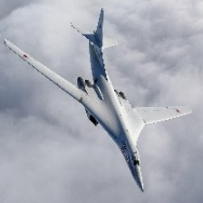
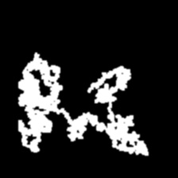
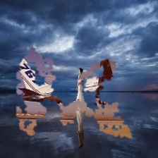
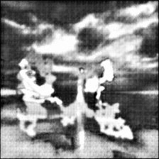
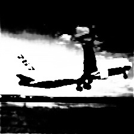
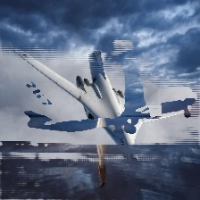
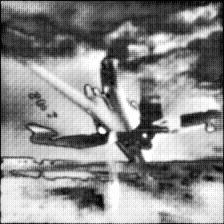
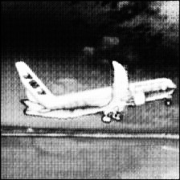
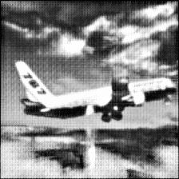

# Copy-Pasting GAN
A TensorFlow implementation of paper **Object Discovery with a Copy-Pasting GAN**.

## Requirements
- Python 3.7
- TensorFlow 1.13.1

## Run
1. Prepare dataset
   1. Prepare foreground and background images(`jpg` format only);
   2. Put foreground images into `data/plane_sky/plane`;
   3. Put background images into `data/plane_sky/sky`;
   4. Resize foreground and background images to $240\times240$;(You can use `img_utils.py` in `utils` folder);

   - You can change image format in `train.py` and `utils/img_utils.py`;
   - You can change image folder in `cfgs.py`;
2. Train with `python main.py`.
3. You can find checkpoints and saved images in `logs`. :)

## Results
|  |  |  |
| :----------------------------------------------------------: | :----------------------------------------------------------: | :----------------------------------------------------------: |
|                          Foreground                          |                          Background                          |                  Random selected foreground                  |
|  |  |  |
|                    Random generated Mask                     |             Grounded Fake (with random mask)              |         Predicted mask from D (for Grounded Fake)         |
|  |  |  |
|          Predicted mask from G (for Foreground)           |       Anti-shortcut (foreground+random foreground)        |         Predicted mask from D (for Anti-shortcut)         |
|  |  |  |
|          Predicted mask from D (for Foreground)           |       **Composited image** (foreground+background)        |       Predicted mask from D (for Composited image)        |
